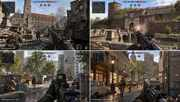

# 135er – Spandau Defeat

**Current milestone:** `0.4.0-history` · **Unreal Engine 5.8 / C++**

135er – Spandau Defeat is a native multiplayer first-person shooter built around recognizable locations in Berlin-Spandau and selected historical Berlin scenarios. The design goal is fast, direct, class-based objective play inspired by the immediacy of classic Day of Defeat Beta 3.1, while using an independent codebase, original/licensed assets and its own visual identity.

> **Visual target / concept art.** The images in this repository define atmosphere and art direction; they are not presented as final in-engine screenshots. Final maps target photorealistic Unreal Engine 5.8 rendering.

## Engine and multiplayer

- Unreal Engine 5.8 C++
- native desktop client — no browser gameplay path
- Windows 10+, Linux x86_64 and macOS desktop target
- Linux x86_64 headless Dedicated Server target
- server-authoritative CharacterMovement and hitscan combat
- health, death, kills/deaths and respawn
- automatic team balancing
- three replicated capture objectives per battlefield
- nominal ~1 km x 1 km battlefield profiles
- 60 Hz server/network configuration
- runtime 3D graybox generation with collision for gameplay iteration

## Final visual target

The graybox system is only the gameplay scaffold. Production maps are planned around photorealistic PBR/Nanite environment assets, Lumen lighting, Virtual Shadow Maps, World Partition/HLOD, authored collision, period-appropriate props and recognizable Spandau architecture. Gameplay collision and render detail remain separable so the dedicated server does not depend on visual complexity.

## Core Spandau map set

| ID | Map |
|---|---|
| `rathaus_spandau` | Rathaus Spandau |
| `zitadelle` | Zitadelle Spandau |
| `staaken` | Staaken |
| `rodelberg` | Rodelberg |
| `kiesteich` | Kiesteich / Spekte-area |
| `falkenhagener_feld` | Falkenhagener Feld |
| `lynarstrasse` | Lynarstraße |
| `wroehmaennerpark` | Wröhmännerpark |
| `freiheit` | Freiheit / industrial district |

## Historical / special maps

| ID | Period / treatment |
|---|---|
| `fort_hahneberg_1945` | Fort Hahneberg, 1945-inspired fortress scenario |
| `teufelsberg_coldwar` | Cold War listening-station special map outside Spandau |
| `flugplatz_gatow_1945` | Gatow military airfield, 1945 |
| `gatow_luftbruecke_1948` | Berlin Airlift logistics/objective scenario |
| `radeland_1945` | Radelandstraße occupation-period barracks setting |
| `hakenfelde_heeresamt_1944` | Hakenfelde wartime industrial/warehouse setting |
| `zitadelle_1945` | 1 May 1945 security/approach scenario; the Citadel surrendered without a fight |
| `britischer_sektor_spandau` | British-sector / Cold War Spandau scenario |

Historical material is labeled so documented events are not confused with gameplay fiction. See [docs/HISTORY_MAPS.md](docs/HISTORY_MAPS.md).

## Map media

Individual concepts and the current gallery are in [media/maps](media/maps). They are project concept artwork, not copied game screenshots and not evidence of finished photoreal map art.

## Source snapshot

The current Unreal source snapshot is stored at:

`game/releases/135er-spandau-defeat-unreal-0.4.0-history-source.tar.xz`

A licensed Unreal Engine 5.8 installation/source build is required for compilation. The project contains both `SpandauDefeat` and `SpandauDefeatServer` targets.

## Repository layout

- `docs/` – gameplay, maps, history and production notes
- `media/maps/` – map concepts / visual-target material
- `game/releases/` – versioned Unreal source snapshots
- `media/` – project key art and media notes

> This repository is the canonical project source for 135er – Spandau Defeat.
