

  

<strong>Counter-Strike 2 / Source 2 multiplayer project · Berlin-Spandau · objective combat</strong>

<code>0.2.1-source2-alpha</code> · <code>20 maps</code> · <code>20 production specs</code> · <code>Linux Dedicated Server</code> · <code>CounterStrikeSharp</code>

## CURRENT SOURCE 2 STATUS

**135er – Spandau Defeat** is now fully based on the **Counter-Strike 2 / Source 2 toolchain**. The retired Unreal branch and Unreal-era imagery are no longer part of the active project tree.

Implemented:
- Linux CS2 dedicated-server baseline
- CounterStrikeSharp plugin builds and loads
- A/B/C objective state
- configurable tickets and ticket bleed
- map / mode / status commands
- PufferPanel / JL76 integration
- **20-map roster**
- **20 / 20 map production specs**
- bot/navigation production standard
- Source 2 visual-master and capture rules
- **20-map AI master-reference gallery visible directly in this README**

Pending before a playable map alpha:
- authored Hammer `.vmap` sources
- compiled Source 2 maps
- map-side objective triggers
- final class/weapon restrictions
- final HUD
- first genuine Source 2 in-engine screenshots
- Workshop publication

## SOURCE 2 OPTICAL MASTER — ALL 20 MAPS

  

> The image above contains the **AI-generated optical-master/reference images for all 20 current maps**. These are the visual targets for Hammer/Source 2 production and are **not genuine in-engine screenshots**.

### INDIVIDUAL MAP MASTER REFERENCES

| Map | AI master reference |
|---|---|
| Rathaus Spandau | 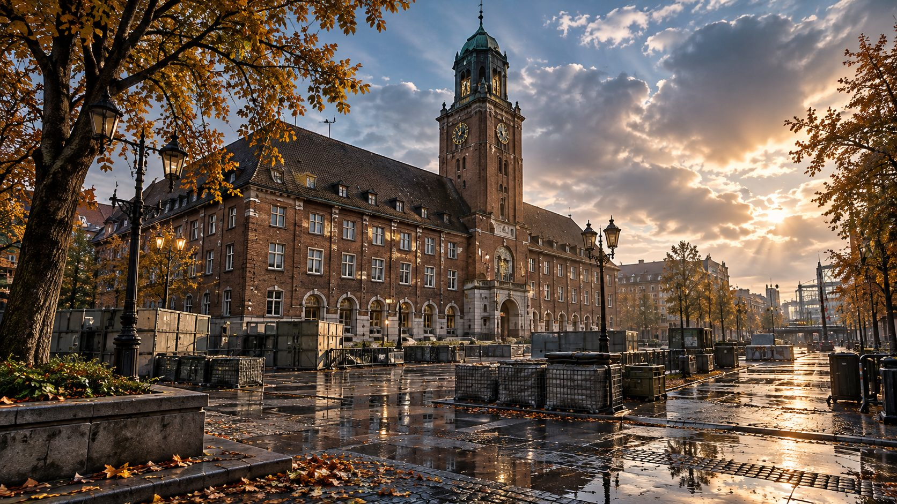 |
| Zitadelle Spandau | 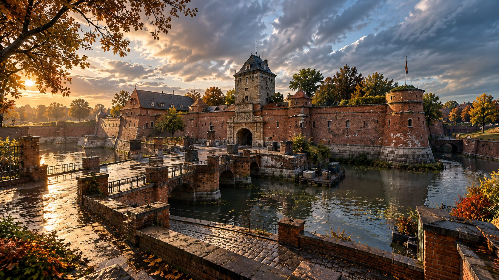 |
| Staaken | 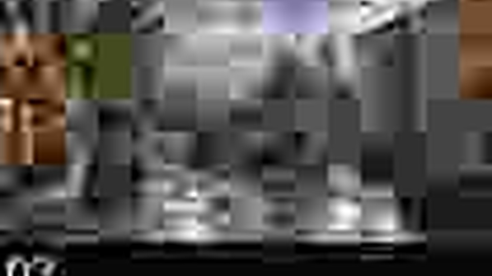 |
| Rodelberg | 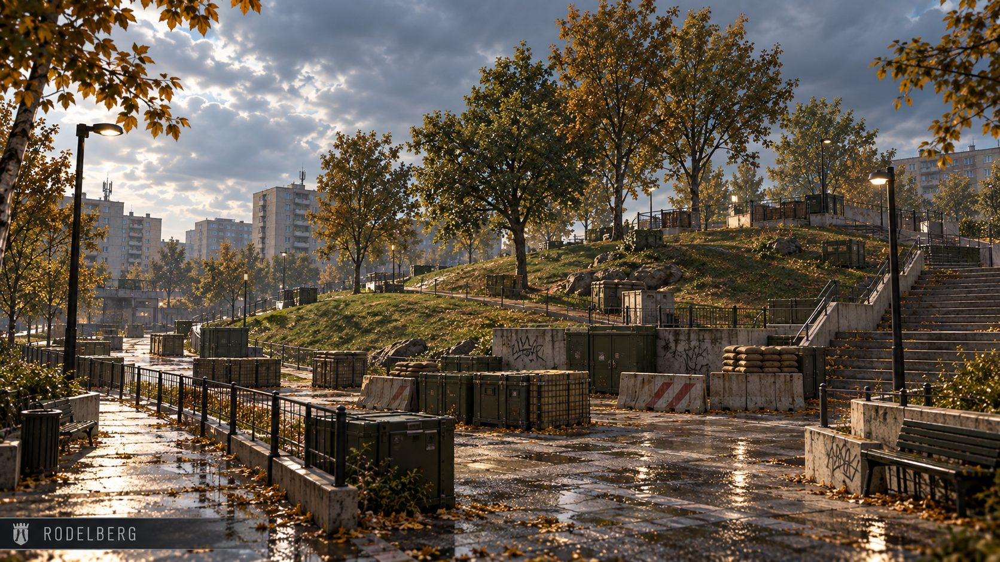 |
| Kiesteich | 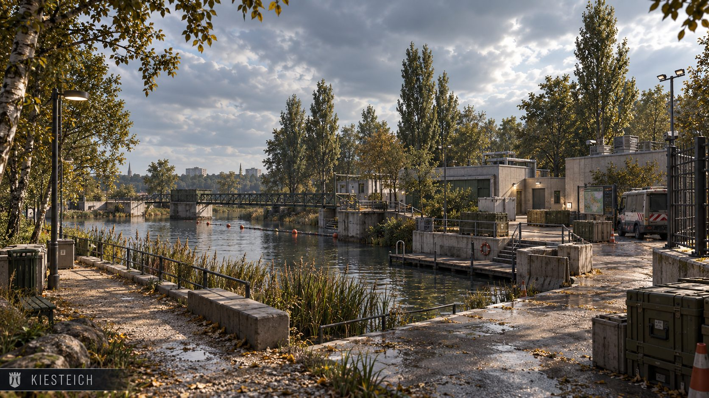 |
| Falkenhagener Feld | 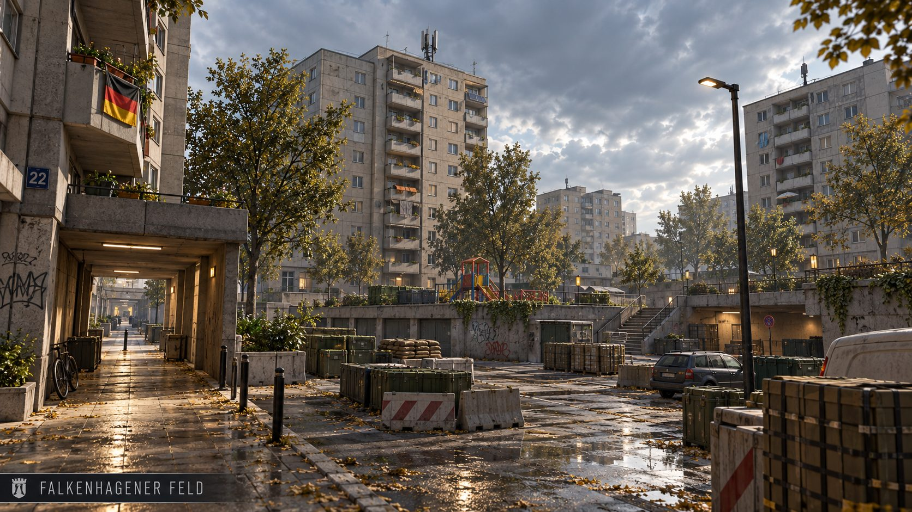 |
| Lynarstraße |  |
| Wröhmännerpark | 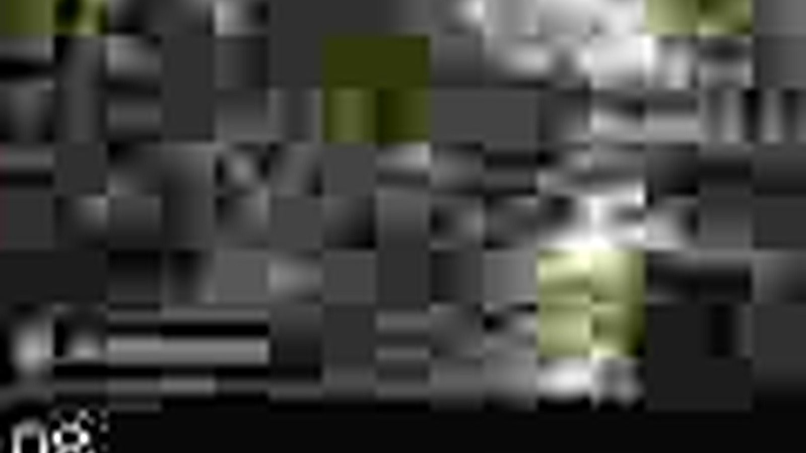 |
| Freiheit |  |
| Martin-Buber-Schule | 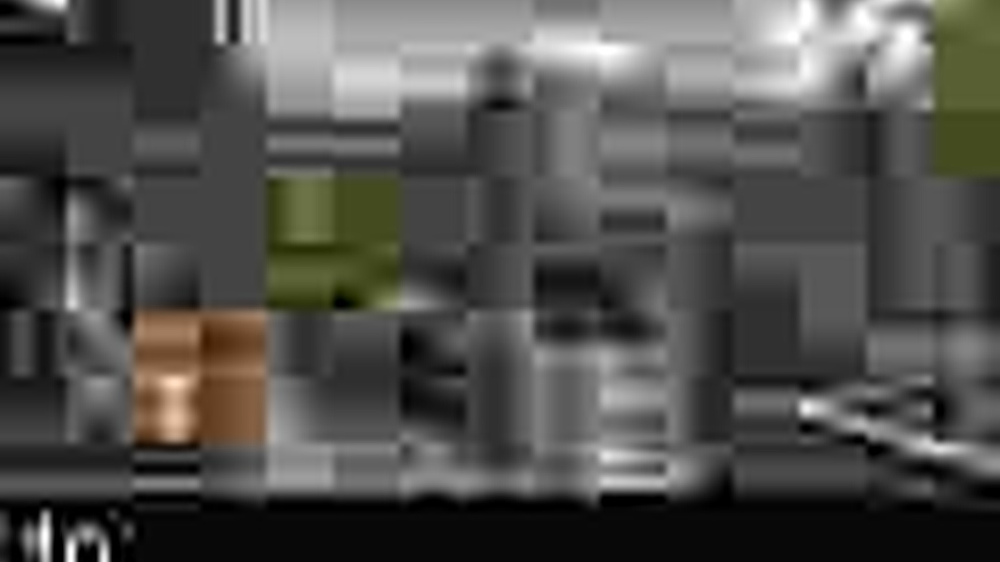 |
| Askanier-Schule |  |
| B.-Traven-Schule | 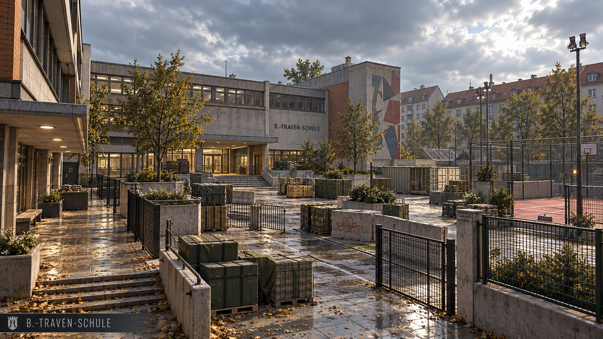 |
| Fort Hahneberg 1945 | 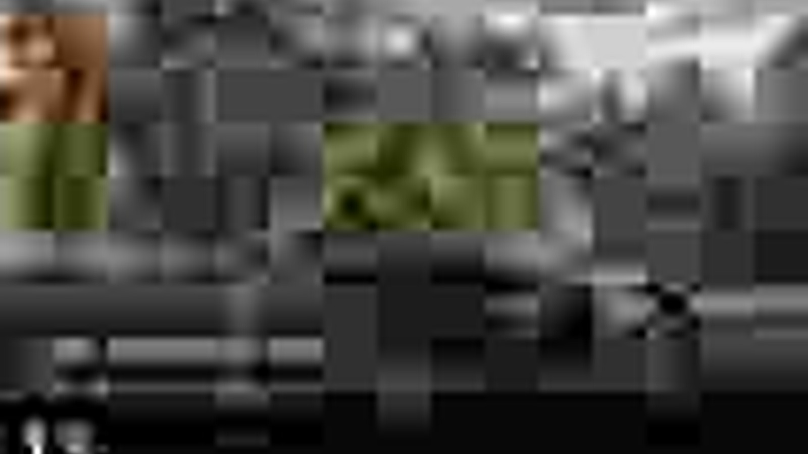 |
| Teufelsberg – Kalter Krieg |  |
| Flugplatz Gatow 1945 |  |
| Gatow – Luftbrücke 1948 | 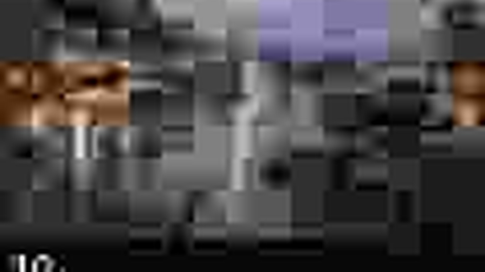 |
| Radelandstraße 1945 | 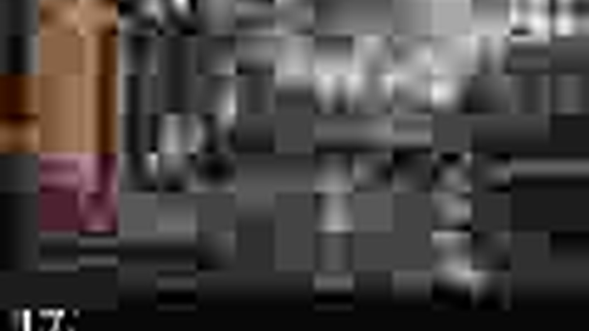 |
| Hakenfelde – Heeresamt 1944 | 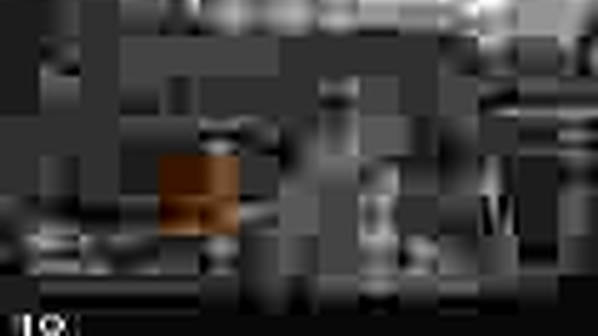 |
| Zitadelle Spandau – 1. Mai 1945 | 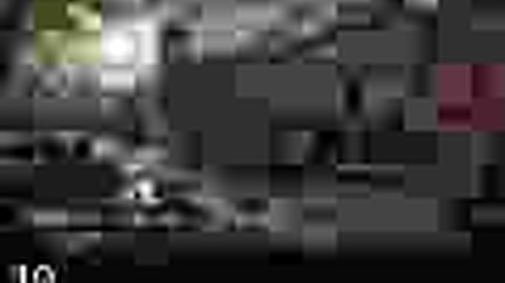 |
| Britischer Sektor Spandau |  |

> These 20 files are **AI optical-master/reference art**, not Source 2 in-engine captures. Public gameplay screenshots remain reserved for genuine compiled Source 2 / CS2 captures.

The optical master defines:
- competitive Source 2-style readability
- physically grounded materials and lighting
- sharp local architecture and landmarks
- restrained atmospheric effects
- practical cover silhouettes and sightlines
- recognizable Spandau identity

## MAPS — 20 TOTAL

**12 core maps:** Rathaus Spandau · Zitadelle · Staaken · Rodelberg · Kiesteich · Falkenhagener Feld · Lynarstraße · Wröhmännerpark · Freiheit · Martin-Buber-Schule · Askanier-Schule · B.-Traven-Schule

**8 historical/special maps:** Fort Hahneberg 1945 · Teufelsberg – Kalter Krieg · Flugplatz Gatow 1945 · Gatow – Luftbrücke 1948 · Radelandstraße 1945 · Hakenfelde – Heeresamt 1944 · Zitadelle – 1. Mai 1945 · Britischer Sektor Spandau

## IMAGE RULE

- **Optical master/reference:** may be AI-generated, but must be identified as reference art.
- **In-game/gameplay:** must come from an actually compiled and running Source 2 / CS2 map.
- no Unreal screenshots or Unreal reference imagery remain in the active media set.

## PROJECT LINKS

| Area | Path |
|---|---|
| Build status | [source2/docs/BUILD_STATUS.md](source2/docs/BUILD_STATUS.md) |
| Project metadata | [source2/build/project.json](source2/build/project.json) |
| Map roster | [source2/maps/maps.json](source2/maps/maps.json) |
| Map list | [source2/maps/maplist.txt](source2/maps/maplist.txt) |
| 20 map specs | [source2/maps/specs/](source2/maps/specs/) |
| Bot/nav standard | [source2/maps/nav/BOT_NAV_STANDARD.md](source2/maps/nav/BOT_NAV_STANDARD.md) |
| Map production pipeline | [source2/docs/MAP_PRODUCTION_PIPELINE.md](source2/docs/MAP_PRODUCTION_PIPELINE.md) |
| Visual master | [docs/VISUAL_MASTER.md](docs/VISUAL_MASTER.md) |
| Image/capture policy | [docs/INGAME_CAPTURE_STANDARD.md](docs/INGAME_CAPTURE_STANDARD.md) |
| 20-map master gallery | [media/source2/masters/all-maps-master-gallery.jpg](media/source2/masters/all-maps-master-gallery.jpg) |
| Source 2 media | [media/README.md](media/README.md) |

---

<strong>135er – SPANDAU DEFEAT</strong> SOURCE 2 · SPANDAU · HISTORY · URBAN WARFARE

