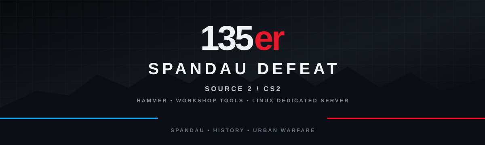
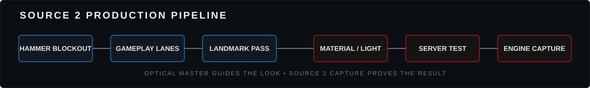
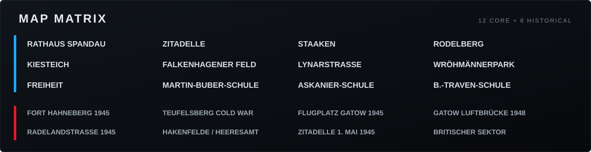
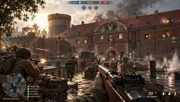
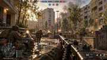
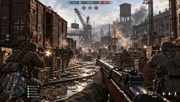

  

<strong>Source 2 / CS2 multiplayer shooter project set across recognizable Spandau locations and selected historical scenarios.</strong>

<code>0.6.0-source2-migration</code> &nbsp;•&nbsp; <code>Source 2 / CS2</code> &nbsp;•&nbsp; <code>Hammer</code> &nbsp;•&nbsp; <code>Workshop Tools</code> &nbsp;•&nbsp; <code>Linux Dedicated Server</code>

## MISSION PROFILE

**135er – Spandau Defeat** is a multiplayer first-person shooter built around the direct objective-play feel of classic Day of Defeat, using **Source 2 / Counter-Strike 2 as the active engine/runtime direction**.

> **Engine decision:** the previous Unreal Engine branch is retired. The active project direction is Source 2 / CS2.

## SOURCE 2 PRODUCTION PATH

- Runtime: Counter-Strike 2 / Source 2
- Authoring: Hammer + CS2 Workshop Tools
- Server: Linux CS2 dedicated server
- Map pipeline: blockout → gameplay lanes → landmark pass → materials/lighting → nav/gameplay validation → engine capture
- Gameplay direction: fast spawn-to-action, low TTK, class/weapon roles, A/B/C objectives, attack/defend, breakthrough and demolition-style variants
- Public image rule: real **in-game** screenshots must come directly from the running Source 2 / CS2 project

See [`docs/SOURCE2_PIPELINE.md`](docs/SOURCE2_PIPELINE.md).

## MAP ROSTER — 20 MAPS

### Core Spandau maps

| Urban / landmark | Terrain / park | School maps |
|---|---|---|
| Rathaus Spandau | Rodelberg | Martin-Buber-Schule |
| Zitadelle Spandau | Kiesteich | Askanier-Schule |
| Staaken | Wröhmännerpark | B.-Traven-Schule |
| Falkenhagener Feld | Freiheit | |
| Lynarstraße | | |

### Historical / special maps

Fort Hahneberg 1945 · Teufelsberg Cold War · Flugplatz Gatow 1945 · Gatow Luftbrücke 1948 · Radelandstraße 1945 · Hakenfelde/Heeresamt 1944 · Zitadelle 1. Mai 1945 · Britischer Sektor Spandau.

  
  

  
  

> The images above are **optical masters / concept references**. They define atmosphere, composition and readability. They are **not** presented as Source 2 gameplay captures.

## VISUAL TARGET

The optical masters remain binding for landmark recognition, grounded materials, first-person readability, objective routes and tactical HUD language. Final implementation now targets equivalent results through Source 2 materials, lighting, particles and Hammer-authored environments.

## IMAGE STANDARD

**Optical master / concept:** allowed as a clearly labeled visual target.

**In-game:** only a capture made by the running Source 2 / CS2 project may be labeled **in-game**.

No AI-generated image, external render or mockup may be mislabeled as gameplay.

See [`docs/VISUAL_MASTER.md`](docs/VISUAL_MASTER.md) and [`docs/INGAME_CAPTURE_STANDARD.md`](docs/INGAME_CAPTURE_STANDARD.md).

## PROJECT NAVIGATION

| Area | Location |
|---|---|
| Source 2 project root | [`source2/`](source2/) |
| Source 2 pipeline | [`docs/SOURCE2_PIPELINE.md`](docs/SOURCE2_PIPELINE.md) |
| Map definitions / modes | [`docs/MAPS_AND_MODES.md`](docs/MAPS_AND_MODES.md) |
| Visual master | [`docs/VISUAL_MASTER.md`](docs/VISUAL_MASTER.md) |
| Historical maps | [`docs/HISTORY_MAPS.md`](docs/HISTORY_MAPS.md) |
| In-game capture standard | [`docs/INGAME_CAPTURE_STANDARD.md`](docs/INGAME_CAPTURE_STANDARD.md) |
| Engine captures | [`media/ingame/`](media/ingame/) |

## RUNTIME / DISTRIBUTION DIRECTION

- player runtime through CS2 / Source 2
- maps authored with Hammer / CS2 Workshop Tools
- Linux dedicated server as server target
- project remains intended to be free for players
- original project content stays separated from Valve-owned engine/game content

---

<strong>135er – SPANDAU DEFEAT</strong> SOURCE 2 • SPANDAU • HISTORY • URBAN WARFARE
