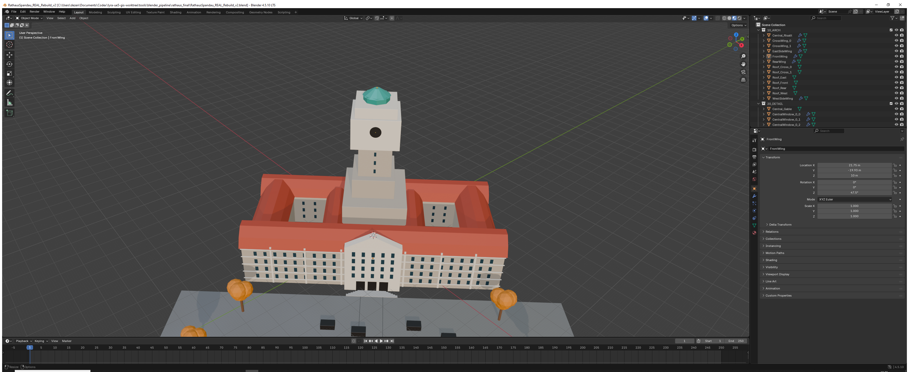

  

<strong>135er - Spandau Strike | Berlin-Spandau | Source 2 + Unreal Engine 5 / Lyra</strong>

<code>20 maps</code> | <code>Berlin GIS</code> | <code>Blender Master Pipeline</code> | <code>Source 2 / CS2</code> | <code>UE 5.8 / Lyra</code>

# Current project status - 2026-10-03

The project is developed for two active engine targets from one shared Berlin GIS / Blender data pipeline:

- **Unreal Engine 5.8 / Lyra** - Rathaus Spandau is the active production focus; the existing playable GIS baseline remains available for validation.
- **Counter-Strike 2 / Source 2** - Rathaus Spandau is the active production focus; retail/addon packaging and final runtime validation remain in progress.
- **Blender master** - Rathaus Spandau now uses Berlin3D 2025 / LoD2 as measured geometry reference; clean game geometry is rebuilt from those real dimensions.
- **Berlin geodata** - Berlin3D 2025, LoD2, DGM1 and real roads/water are the authoritative spatial basis. Concept/master images are used only for look, atmosphere and set dressing.

> Project name: **135er - Spandau Strike**. Older repository/package identifiers may still contain "Spandau Defeat" for compatibility and will be migrated gradually.
### Current Rathaus-first production rule

Rathaus Spandau is the current cross-engine reference map. Until this map has passed geometry, gameplay, collision/nav and visual QA, the other maps remain deferred.

For every current and future map the build order is mandatory:

1. measured/known 3D and geodata first (Berlin3D, LoD2, DGM1, roads, water)
2. clean game geometry derived from that real spatial basis
3. gameplay layer (spawns, objectives, cover, sightlines, collision, navigation)
4. master/reference look (materials, weather, wetness, autumn mood, props, branding)

Raw Berlin3D/LoD2 source datasets and generated Blender working files are not redistributed in this repository. The repository contains the reproducible build/analysis pipeline instead.

See [docs/MAP_BUILD_POLICY.md](docs/MAP_BUILD_POLICY.md).

## Verified UE5 / Lyra milestone
- UE 5.8.3 Lyra Starter Game project is operational.
- Playable map: `/ShooterMaps/Maps/SpandauStrikeGIS/falkenhagener_feld`
- ShooterCore runtime and Control Points A/B/C active.
- 8 LyraPlayerStart actors.
- NavMeshBoundsVolume + RecastNavMesh.
- Warmup -> Playing transition verified.
- Standalone `?NumBots=7` verified.
- 4,560 usable GIS building actors in the 1.8 km x 1.8 km production import.
- 1,096 OSM elements processed.
- 4,805 road/path segments and 230 water segments generated.

### Engine-capture publication status

A genuine UE5/Lyra runtime capture exists for development verification, but the current blockout does **not** yet pass the public presentation quality gate and is therefore not shown in the public README.

The current UE map is a **playable GIS/gameplay blockout**, not final art. Terrain elevation, collision quality, street surfaces, water, vegetation, landmark replacements and final materials remain active production work.

## Blender / terrain master

The shared Blender pipeline lives under `tools/blender_pipeline/`.

Current Falkenhagener Feld terrain coverage uses four Berlin DGM1 tiles:

- `374_5822`
- `376_5822`
- `374_5824`
- `376_5824`

The Blender master provides common optimized terrain/geometry exports for UE5 and Source 2.
## Source 2 / CS2 status

Current verified/staged state:
- Linux CS2 dedicated-server baseline and CounterStrikeSharp plugin are working.
- 20 / 20 Hammer VMAP sources exist locally.
- 20 / 20 maps have Berlin LoD2 building integration.
- 20 / 20 DGM terrain reference VMAPs are generated and pass Valve DMX validation.
- Rathaus Spandau is the current full gameplay reference.
- Gameplay v2 and NAV seed data are generated for the other 19 maps.
- Gameplay v2 + NAV seed VMAP validation: 19 OK / 0 FAIL.
- Final runtime map compilation is currently blocked by the local Workshop Tools / Steam authentication context and the development machine's Source 2 compile environment.

Next Source 2 milestone:
- restore authenticated Workshop Tools compile context
- complete runtime compile for staged maps
- validate collision/navmesh in the running game
- capture genuine Source 2 in-engine screenshots
- package the first playable release

**No Source 2 gameplay screenshot is published until a real Source 2 map is running and the capture has passed visual QA.**

## Maps - 20 total

**12 core maps:** Rathaus Spandau | Zitadelle | Staaken | Rodelberg | Kiesteich | Falkenhagener Feld | Lynarstrasse | Wroehmaennerpark | Freiheit | Martin-Buber-Schule | Askanier-Schule | B.-Traven-Schule

**8 historical/special maps:** Fort Hahneberg 1945 | Teufelsberg - Cold War | Flugplatz Gatow 1945 | Gatow - Airlift 1948 | Radelandstrasse 1945 | Hakenfelde - Heeresamt 1944 | Zitadelle - 1 May 1945 | British Sector Spandau

## Public image quality gate

Public README images must pass all of these checks before commit:
- manually inspected at full resolution
- sharp and readable at normal GitHub display size
- no broken mosaic/contact-sheet enlargement
- no obvious compression corruption or failed generation
- no misleading engine label
- gameplay images must be genuine captures from the named engine
- reference/concept art is not published in the public README
- failed or uncertain images stay local and are not committed

See [docs/IMAGE_QA.md](docs/IMAGE_QA.md).
## Production order

1. Berlin geodata/reference acquisition
2. Blender master cleanup and terrain generation
3. engine-specific export
4. blockout and landmark architecture
5. playable collision, spawns, objectives and navigation
6. materials, roads, water and vegetation
7. combat readability / sightline pass
8. compile and standalone/server validation
9. genuine in-engine screenshot + visual QA
10. release packaging

## Key project paths

| Area | Path |
|---|---|
| Current cross-engine status | [docs/CURRENT_STATUS.md](docs/CURRENT_STATUS.md) |
| Map roster / modes | [docs/MAPS_AND_MODES.md](docs/MAPS_AND_MODES.md) |
| UE5/Lyra GIS status | [lyra/docs/GIS_STATUS.md](lyra/docs/GIS_STATUS.md) |
| UE5/Lyra map definitions | [lyra/maps/maps.json](lyra/maps/maps.json) |
| Source 2 build status | [source2/docs/BUILD_STATUS.md](source2/docs/BUILD_STATUS.md) |
| Source 2 map definitions | [source2/maps/maps.json](source2/maps/maps.json) |
| Source 2 production pipeline | [source2/docs/MAP_PRODUCTION_PIPELINE.md](source2/docs/MAP_PRODUCTION_PIPELINE.md) |
| Blender master pipeline | [tools/blender_pipeline/README.md](tools/blender_pipeline/README.md) |
| Capture policy | [docs/INGAME_CAPTURE_STANDARD.md](docs/INGAME_CAPTURE_STANDARD.md) |
| Image QA gate | [docs/IMAGE_QA.md](docs/IMAGE_QA.md) |

---

<strong>135er - SPANDAU STRIKE</strong> BERLIN GIS | BLENDER | SOURCE 2 | UNREAL ENGINE 5

### Rathaus Spandau – current Blender viewport

This screenshot shows the current clean Rathaus Spandau Blender rebuild derived from the measured Berlin3D/LoD2 geometry workflow.

## Rathaus Spandau – current integrated Blender master v4

Current authoritative Blender game-build:

- [RathausSpandau_REAL_Integrated_Master_v4.blend](tools/blender_pipeline/builds/rathaus_spandau/RathausSpandau_REAL_Integrated_Master_v4.blend)
- [Blender viewport screenshot](tools/blender_pipeline/builds/rathaus_spandau/RathausSpandau_REAL_Integrated_Master_v4_Blender.png)
- [Rendered preview](tools/blender_pipeline/builds/rathaus_spandau/RathausSpandau_REAL_Integrated_Master_v4_preview.png)
- [Build provenance / transform metadata](tools/blender_pipeline/builds/rathaus_spandau/RathausSpandau_REAL_Integrated_Master_v4.json)
- [Reproducible finalizer](tools/blender_pipeline/finalize_rathaus_integrated_master_v4.py)

This build combines the clean Rathaus game rebuild with the known Berlin3D 2025 / LoD2 measurements, DGM terrain and prepared real road data. Raw Berlin3D shell/roof geometry is retained only as a hidden reference because the direct photogrammetry mesh is too damaged/triangulated for visible game geometry. Gameplay and optical-master set dressing remain separated in dedicated collections so measured data and authored game content are distinguishable.

## Rathaus Spandau – master-aligned Blender build v6

The current Rathaus Spandau Blender build now applies the approved optical master on top of the real-data geometry workflow:

- [RathausSpandau_MASTER_Aligned_v6.blend](tools/blender_pipeline/builds/rathaus_spandau/RathausSpandau_MASTER_Aligned_v6.blend)
- [Blender viewport screenshot](tools/blender_pipeline/builds/rathaus_spandau/RathausSpandau_MASTER_Aligned_v6_Blender.png)
- [Rendered preview](tools/blender_pipeline/builds/rathaus_spandau/RathausSpandau_MASTER_Aligned_v6_preview.png)
- [Build metadata](tools/blender_pipeline/builds/rathaus_spandau/RathausSpandau_MASTER_Aligned_v6.json)
- [Master alignment script](tools/blender_pipeline/masterize_rathaus_v6_final_scene.py)

The real Berlin3D/LoD2/DGM geometry remains authoritative. The master is applied to facade detailing, materials, copper tower crown, wet Rathausplatz, tram/stops, statue, overhead wires, autumn vegetation, A/B cover, lighting and camera composition.
