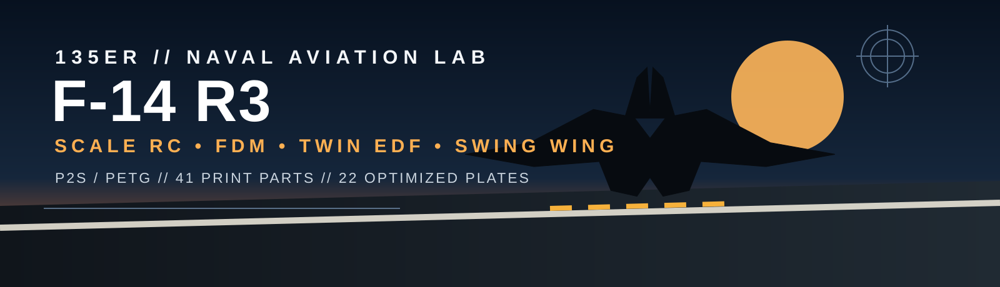

  

# F-14A Tomcat RC FDM — R3 Scale

> **135er Naval Aviation Lab** — scale-reconstructed F-14A RC model for FDM printing on the Bambu Lab P2S.  
> Independent side project: **not part of the Spandau Strike / Source 2 build.**

## Mission profile

| Item | R3 target |
|---|---:|
| Scale | approx. 1:20 |
| Length | 955 mm |
| Extended span target | 977.5 mm |
| Power | Twin 50 mm EDF |
| Battery | 4S 3300–4000 mAh |
| Printer | Bambu Lab P2S, 256 × 256 mm |
| Material | PETG |
| Printable STL parts | **41** |
| Individual 3MF files | **41 + assembled reference** |
| Optimized P2S plates | **22** |

The exterior is reconstructed from the supplied F-14A plan and published overall aircraft dimensions. RC/FDM references are used for packaging, segmentation and mechanism engineering only. This is **not Grumman OEM CAD**.

## 3D viewer

When the generated files have been committed by the build workflow, click the STL directly in GitHub:

- [Full assembled F-14 R3 — GitHub 3D viewer](stl/F14_R3_assembled_reference.stl)
- [Wing box](stl/wing_box.stl)
- [Left wing root](stl/wing_L_root.stl)
- [Right wing root](stl/wing_R_root.stl)
- [Left intake](stl/intake_L.stl)
- [Right intake](stl/intake_R.stl)

GitHub displays STL files in its interactive 3D viewer. The assembled STL is a fit/visualization reference; print the individual parts or the prepared P2S plates.

## P2S print package

The R3 build now generates:

- `stl/` — OpenSCAD-exported individual STL parts
- `p2s/individual_3mf/` — one import-ready 3MF per part
- `p2s/plates_3mf/` — **22 P2S-optimized plate 3MF files**
- `p2s/plate_stl/` — combined STL fallback/preview for each plate
- `p2s/plate_manifest.csv` — contents + estimated planning time
- `p2s/profiles.json` — PETG profile families
- `docs/mesh_validation.*` — automated mesh checks
- `scad/generated_parts/` — one generated OpenSCAD polyhedron source per STL

### Plate optimization rules

1. **Critical structure gets its own job.** The wing box is isolated; losing a long mixed plate to one structural failure is avoided.
2. **Symmetric parts share conditions when the bed allows it.** Tailerons and EDF pairs print together.
3. **Fuselage and duct segments stand on their cut faces**, minimizing support and improving ring/joint geometry.
4. **Wing roots remain separate jobs** because each nearly fills the P2S plate and is structurally important.
5. **Long/high-risk jobs are not used as filler plates.**
6. Plate times are balanced by component type, estimated extrusion volume and failure cost rather than by maximum bed fill.

See [PRINT_PLATES.md](PRINT_PLATES.md).

## RC build plan

See [BUILD_PLAN.md](BUILD_PLAN.md) for:

- Twin 50 mm EDF installation
- M5 steel wing pivots
- CFK reinforcement
- 20–25 kg·cm wing-sweep servo
- taileron servos
- receiver/BEC/ESC wiring
- assembly order
- ground and pre-flight testing

## Validation gate

Current local R3 validation:

- **41 / 41** printable STL parts watertight
- **41 / 41** winding-consistent
- **41 / 41** fit the P2S build volume in at least one print orientation
- **22 / 22** optimized P2S plate 3MF layouts remain inside 256 × 256 mm
- failed geometry checks: **0**

Printability validation is not a flight release. The real prototype must still establish measured mass/CG, EDF thrust/current, servo load, sweep-cycle reliability, radio range/failsafe and flutter envelope.

---

### Deck status

**R3 geometry: GREEN**  
**P2S package: GREEN**  
**Physical flight validation: PENDING**
